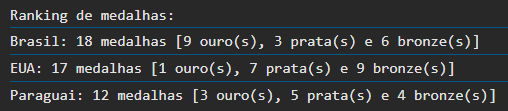

# PretaLab - Desafio de Javascript
Desafio proposto na oficina de JavaScript para seleção do Ciclo Formativo em Cibersegurança.

## 🎯 Sobre o desafio

 O desafio consistia em um programa que receba o número de medalhas de ouro, prata e bronze de um país nas Olimpíadas e calcule o total de medalhas. Quando escrever 'sair', o programa deverá encerrar e mostrar na tela o ranking de medalhas no formato:

 

## 💻 Tecnologias

## 🧙‍♂️ Autora
Feito com 💛 por Sarah Cabral

Vamos nos conectar?

